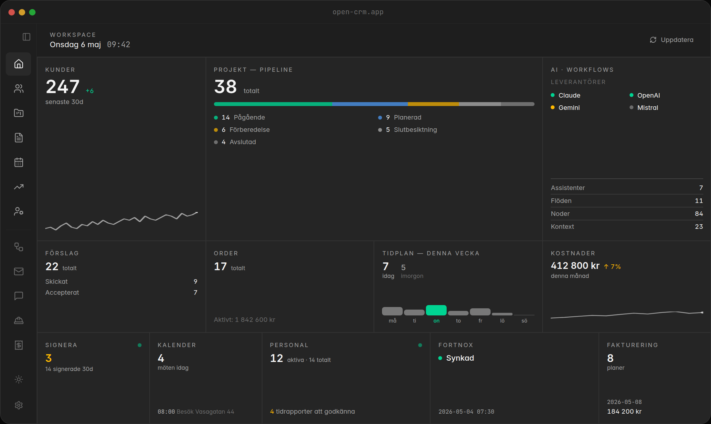
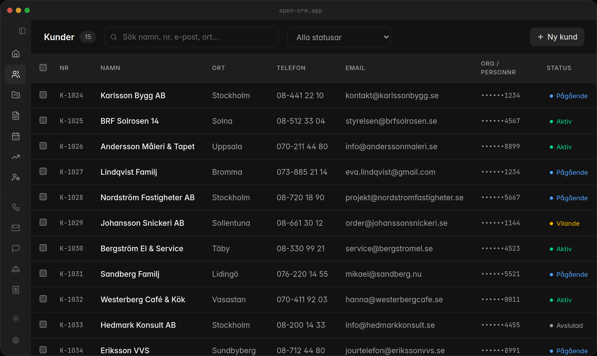
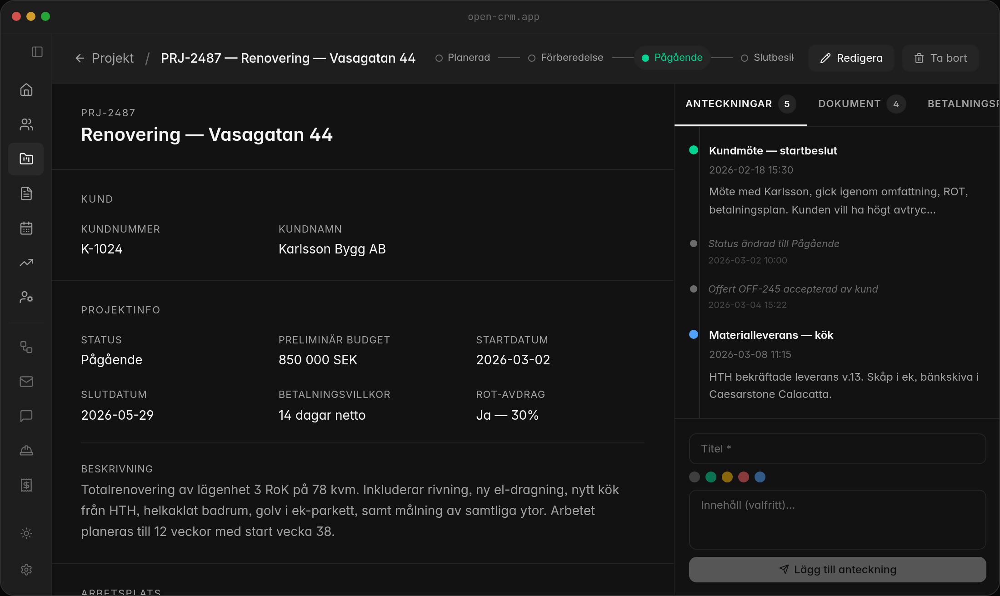
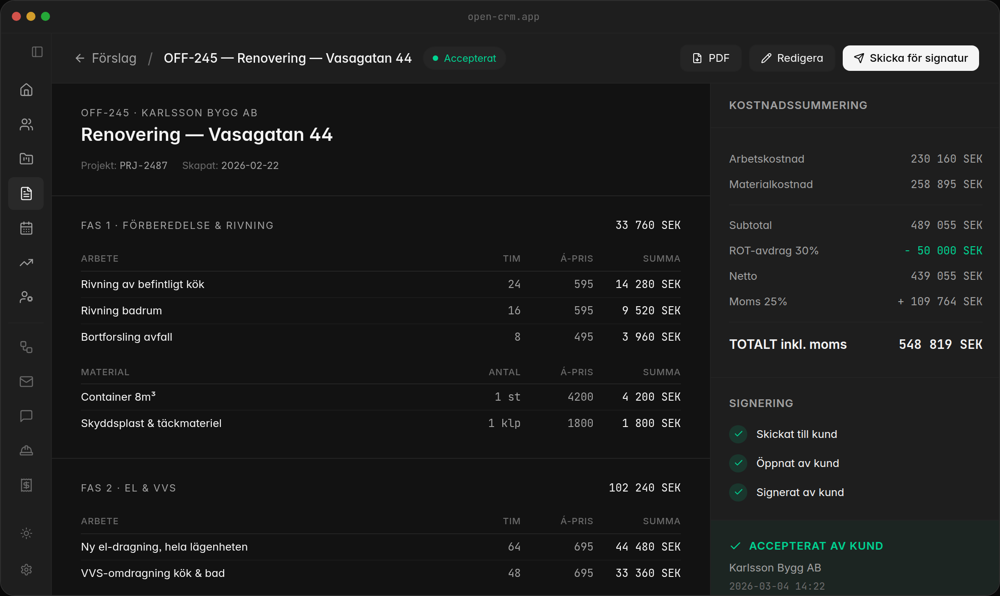
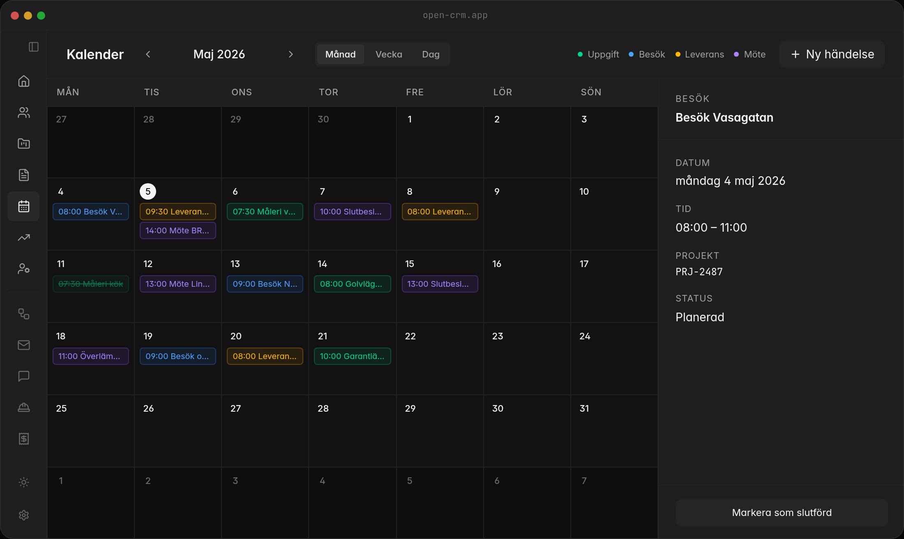
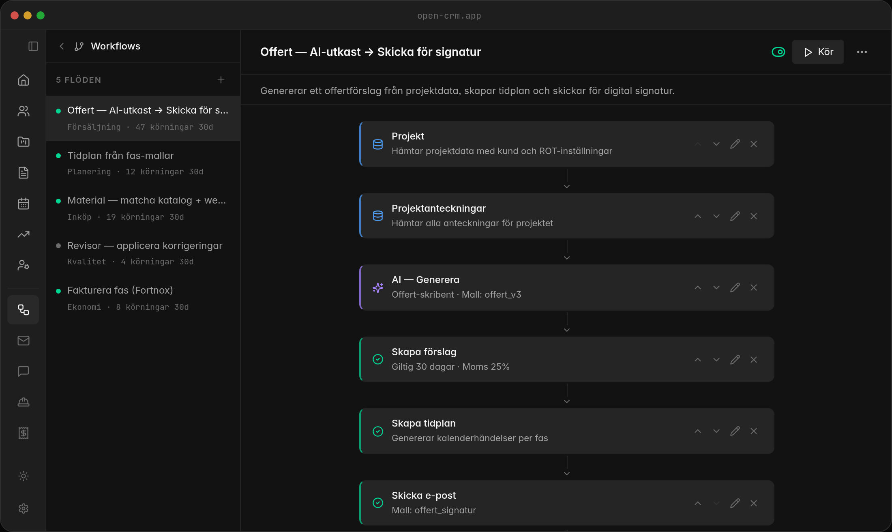
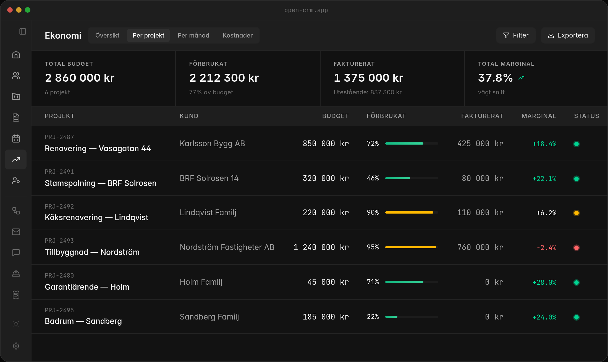
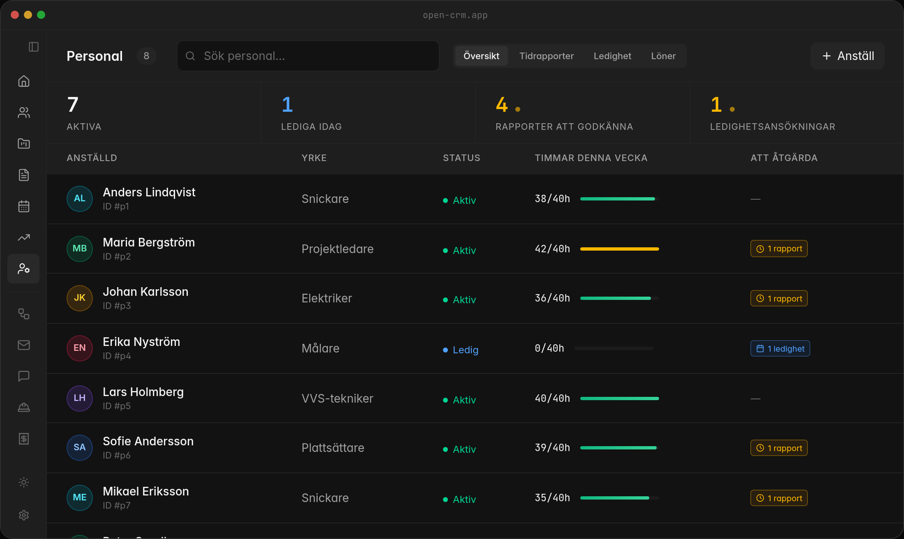
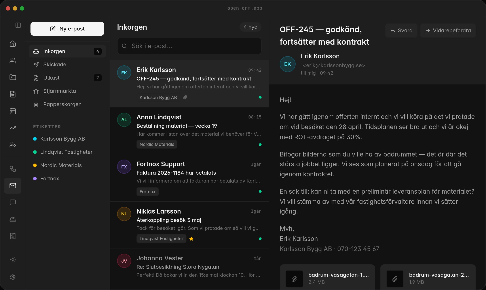
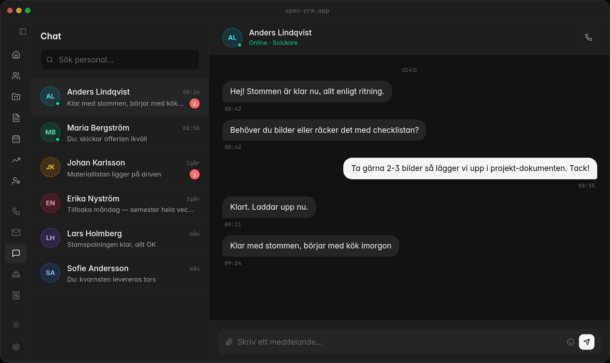

# OpenCRM

> Open source CRM som skyddar din data. Allt körs på din egen server.

A complete CRM for Swedish service companies. Self-hosted, MIT licensed,
no third-party data sharing.

**Live site:** [open-crm.org](https://open-crm.org)
**License:** [MIT](LICENSE)

---

## See it in action

Each module below is a real React view from the desktop app, rendered with
fixture data. Live demo with all 10 modules:
[open-crm.org/sv/produkten](https://open-crm.org/sv/produkten).

### Workspace
Home screen. Active projects, costs, invoicing and today's tasks.



### Kunder — Customers
Companies, people and contact points. With history, notes and status.



### Projekt — Projects
Detail view. Status flow, customer, ROT deduction and activity feed.



### Förslag — Quotes
Quote with phases, labor, materials, ROT deduction and totals.



### Kalender — Calendar
Schedule with tasks, visits, deliveries and meetings — the team calendar.



### Workflows
Visual node editor: trigger → context → AI → action. Git-versioned.



### Ekonomi — Finance
Cost vs budget per project. Margin, invoiced and outstanding.



### Personal — Staff
Staff, status, time reports to approve and time-off requests.



### E-post — Email
Inbox linked to customer and project. Threads, labels and search.



### Chat
Internal communication linked to teams and projects.



---

## What this repository contains

This repo is the source for the **public website** at
[open-crm.org](https://open-crm.org) — the landing page that showcases
the product. Built with:

- **Next.js 16** (App Router, Turbopack)
- **React 19**
- **Tailwind CSS v4**
- **next-intl** for SV / EN / ES localisation
- **TypeScript 5**

The CRM application itself is a separate Electron desktop app and is not
part of this repository.

---

## Run the site locally

```bash
git clone https://github.com/rankgnar/open-crm-public.git
cd open-crm-public
npm install
npm run dev
```

Open [http://localhost:3030](http://localhost:3030).

### Build for production

```bash
npm run build
npm start
```

### Refresh the README screenshots

```bash
node scripts/screenshots.mjs
```

Captures all 10 product previews from the live deployment and writes them
to `public/screenshots/`. Set `BASE_URL=http://localhost:3030` to point
at a local dev server instead.

---

## Get the CRM

The OpenCRM desktop app is currently in private development. To get
access, deploy support or a custom installation, write to
**hello@open-crm.org** — see [open-crm.org/sv/tjanster](https://open-crm.org/sv/tjanster).

---

## License

[MIT](LICENSE) — fork it, run it, ship it.
